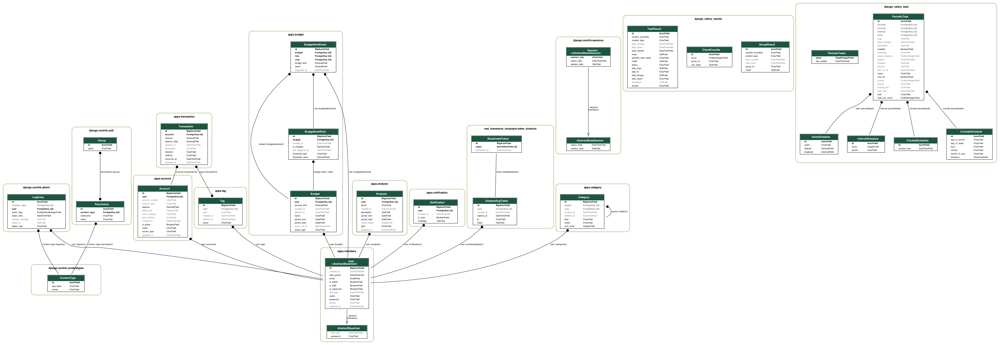

# Budget API 프로젝트

가계부/예산 관리 백엔드(API)와 프론트엔드(React)를 포함한 프로젝트입니다. 사용자 계정, 계좌, 거래, 카테고리/태그, 분석, 알림 기능을 제공합니다.

## 주요 기능

- 회원가입/로그인/로그아웃/프로필 관리
- 계좌 생성/조회/삭제
- 거래 생성/조회/수정/삭제 및 필터링
- 카테고리/태그 CRUD + 휴지통/복구
- 분석(비동기) 및 분석 결과 알림
- Swagger/Redoc API 문서 제공

## 기술 스택

- Backend: Django, Django REST Framework, SimpleJWT
- DB/Cache: PostgreSQL, Redis
- Async: Celery, django-celery-results, django-celery-beat
- API Docs: drf-yasg (Swagger/Redoc)
- Frontend: React, Vite

## 앱 구성

- `apps/members`: 사용자/인증
- `apps/account`: 계좌
- `apps/transaction`: 거래
- `apps/category`: 카테고리
- `apps/tag`: 태그
- `apps/analysis`: 분석(비동기)
- `apps/notification`: 알림
- `apps/trashcan`: 소프트 삭제/복구 공통

## 디렉토리 구조

- `apps/`: 도메인별 Django 앱
- `config/`: Django 설정 및 URL 라우팅
- `frontend/`: React(Vite) 프론트엔드
- `scripts/`: 실행/운영 스크립트
- `API_SPEC.md`: 상세 API 스펙
- `API_SPEC_TABLE.md`: 노션/시트용 표 스펙
- `API_SPEC_SWAGGER.md`: Swagger/DRF 기준 스펙

## 실행 방법 (Docker 권장)

1) `.env.docker` 확인 후 실행
```bash
docker compose -f docker-compose.dev.yml up --build
```

2) 접속
- Backend: `http://localhost:8000`
- Swagger: `http://localhost:8000/swagger/`
- Redoc: `http://localhost:8000/redoc/`
- Frontend: `http://localhost:5173`

## 배포 주소

- Frontend: `http://3.35.79.124:5173/`
- Swagger: `http://budgettest.duckdns.org/swagger/`
- Admin: `http://budgettest.duckdns.org/admin/`

## 로컬 개발 (백엔드만)

사전 준비: Python 3.12, `uv`, PostgreSQL, Redis

환경 변수 예시 (`.env`)
```
DJANGO_SECRET_KEY=unsafe-dev-key
DEBUG=1
POSTGRES_DB=budget
POSTGRES_USER=postgres
POSTGRES_PASSWORD=postgres
DB_HOST=localhost
DB_PORT=5432
CELERY_BROKER_URL=redis://localhost:6379/0
CELERY_RESULT_BACKEND=django-db
```

실행
```bash
uv sync
uv run python manage.py migrate
uv run python manage.py runserver
```

Celery (선택)
```bash
uv run celery -A budget worker -l info
uv run celery -A budget beat -l info
```

## Makefile 사용

자주 쓰는 명령을 `make`로 실행할 수 있습니다.

```bash
make up
make migrate
make erd
make frontend
```

## API 문서

- Swagger: `/swagger/`
- Redoc: `/redoc/`
- 상세 스펙: `API_SPEC.md`, `API_SPEC_TABLE.md`, `API_SPEC_SWAGGER.md`

## 소셜 로그인 (Google)

1) 프론트에서 Google 로그인 버튼 클릭  
2) `/allauth/google/login/`로 이동 → 인증 완료  
3) 프론트 `/auth/social-callback`에서 `/api/users/social/token/` 호출 → JWT 저장

필수 설정:
- `SITE_ID` 설정
- Google OAuth Client 등록 및 콜백 URL 설정
  - 예: `http://localhost:5173/auth/social-callback`

## ERD

`docs/erd.png`에 ERD를 생성해 둡니다.

생성 방법
```bash
./scripts/generate_erd.sh
```

필수 의존성:
- Graphviz (예: macOS `brew install graphviz`, Ubuntu `apt-get install graphviz`)
- 스크립트는 Django `graph_models --dot` 출력 후 `dot`으로 PNG를 생성합니다.



## 프론트엔드 실행 방법

사전 준비: Node.js 20.x, npm

```bash
cd frontend
npm install
npm run dev
```

빌드/미리보기
```bash
npm run build
npm run preview
```

## 배포/CI

CI는 GitHub Actions로 구성되어 있습니다: `.github/workflows/checks.yml`

배포 기본 흐름 예시:
- Backend: `uv sync` → `python manage.py migrate` → `gunicorn config.wsgi:application`
- Frontend: `npm ci` → `npm run build` → 정적 파일 서빙
- Celery: `celery -A budget worker -l info` / `celery -A budget beat -l info`

CI 수행 내용:
- ruff 검사
- DB 대기 → 마이그레이션 → 테스트 실행
- 프론트엔드 CI는 현재 포함하지 않음

